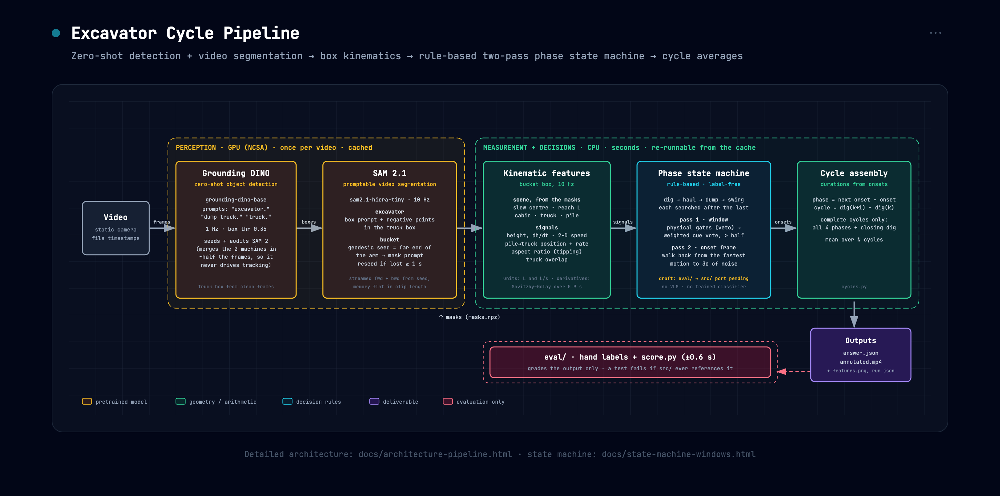

# Excavator Cycle Duration

**Aanya Shah** · starter task, AI video-analytics benchmarking project

This computer-vision pipeline uses rule-based state detection to find every phase of an
excavator work cycle (**digging → hauling → dumping → swinging**) and reports the
average duration of each phase and of a complete cycle. An annotated video shows the
evidence for each decision.

> **Status (draft).** The two-pass state detection described below is implemented and
> tested on saved features (`eval/interval_votes.py`, `eval/find_onsets.py`). `run.py run`
> does not call it yet: it still uses the earlier single-cue state machine
> (`src/excavator_cycles/fsm.py`). It will be moved into `src/` and wired into `run.py`
> before submission. The full write-up is in [`docs/REPORT.md`](docs/REPORT.md).

---

## Design



**Object detection.** The pipeline uses zero-shot detection (Grounding DINO) to find the
excavator and the dump truck, and video segmentation (SAM 2.1) to follow the excavator
frame by frame. No detector can reliably find the bucket, so it is located by geometry,
as the far end of the excavator's arm. SAM 2.1 then tracks the bucket, and re-finds it
when it is buried in the pile or the truck bed. The slew centre, the arm's reach, the
cabin and the dirt pile are computed from the excavator's mask over time rather than
detected.

**Feature generation.** From the bucket's box, the pipeline derives kinematic features
10 times a second:

- height and vertical velocity
- 2-D speed
- position along the line from the pile to the truck
- box aspect ratio, which drops as the bucket tips
- overlap with the truck

Lengths are measured in units of the machine's own reach, and times come from the video
file's timestamps. This means the numbers mean the same thing at any resolution, frame
rate or camera distance.

**State detection.** The features are interpreted by a two-pass state detection system:

1. **Pass 1 (interval).** For the next phase in the cycle, the pipeline finds the interval
   in which the transition occurs. It does this by looking for corroborating patterns
   across several features, in three steps:
   - **Gates** are physical conditions that must hold before any evidence counts, for
     example "the bucket is on the truck side of the cabin" before a dump.
   - A **required cue** must be part of the interval, for example the bucket rising for
     hauling.
   - **Supporting cues** are weighted by how reliably they mark the transition. The
     interval is where cues holding more than half the total weight overlap.
2. **Pass 2 (frame).** Inside that interval, one physical cue per phase picks the
   transition frame:

   | Phase | Transition frame |
   |---|---|
   | Digging | the lowest bucket speed |
   | Hauling | the lift begins |
   | Dumping | the bucket starts to tip |
   | Swinging | the bucket starts moving back along the pile-to-truck line |

The cyclical order of the phases is enforced: each phase is searched for only after the
previous one. Partial cycles at the start and end of the video are ignored.

**Output.** The pipeline writes:

- `answer.json`, with the cycle count, the average duration of each phase and the average
  cycle duration
- an annotated video showing the masks, boxes and current phase

A phase's duration is the time from its start to the next phase's start. A cycle runs
from one dig to the next. Only complete cycles are averaged.

---

## Assumptions and Limitations

As a rule-based detection engine, the pipeline is best suited to videos framed like the
provided one.

- **Static camera.** The pipeline cannot handle camera movement. The slew centre, truck
  position and pile are measured once per video.
- **Visibility.** It works best when the excavator's full motion is visible, and when the
  truck lies to the left or right of the excavator rather than behind or in front of it.
- **One excavator loading one dump truck.** Dumping is defined as over the truck, so
  dumping onto a pile or into a hopper is not detected.
- **Digging height.** It is less effective when the digging happens from an elevated
  location, because several cues rely on the bucket being low while digging.
- **Strict phase order.** A repeated or skipped phase is attributed to the neighbouring
  phase, or stops the search for the rest of the video.
- **The bucket must stay tracked.** A bucket that stays hidden for long, or is
  mis-identified, leaves gaps that the state machine cannot bridge.

---

## Execution

**How the rules were derived.** The phase boundaries of the provided video were labelled
by hand, frame by frame. The feature graphs were then studied for patterns that line up
with each transition. A pattern was kept only if it could be explained by the physics of
the motion, for example a loaded bucket must rise to clear the material before hauling.

Following the task's definition, dumping begins when the bucket starts to **tip**, read
from the bucket box's aspect ratio. This is not the moment it arrives over the truck.

**What the pipeline never uses.** The labels are used only to score results. The pipeline
never reads them or `answer.json`, and a test fails if any pipeline code references them.
Thresholds are set relative to each video's own signals, never to fixed pixel or frame
values. No vision-language model is used.

**Testing.** On the two hand-labelled videos, which were also used to derive the rules
and so give optimistic scores:

| Video | Intervals that contain the true transition | Transition frames within ±0.6 s |
|---|---|---|
| 83 s clip (3 cycles) | 13 / 13 | 10 / 13 |
| Provided video (1 cycle) | 4 / 5 | 3 / 5 |

On the provided video, the dump label marks the bucket arriving over the truck, about 2 s
before it tips. That explains the one missed interval.

The rules were then frozen and run on five open-source excavator videos they had not been
tuned on. They recovered one complete cycle. Most failures traced back to the bucket
being lost or mis-tracked, or to camera motion. This is the main area for further work.

**Compute.** Detection and segmentation ran on a GPU (NCSA Jupyter cluster). Everything
after that runs on a CPU in seconds, from cached masks.

---

## Alternatives Considered

Each alternative below was built or measured, not just imagined, unless the table says
otherwise. The design above was chosen because it was the simplest one that held up. Some
of these may still improve robustness, but none did enough to justify its complexity.
Full evidence is in [`docs/REPORT.md`](docs/REPORT.md) and `docs/stages/`.

### Finding the bucket

| Alternative | What happened | Why it was not used |
|---|---|---|
| **Detect the bucket with Grounding DINO or OWLv2** | 19 prompt × model combinations were tried. The best prompt, `"excavator bucket."`, boxed the whole machine. | The detector matches the word "excavator" and ignores "bucket". |
| **YOLO-World** (open-vocabulary detector) | Pre-registered pass/fail criteria, run before looking at results. `"excavator bucket"` and `"excavator cab"` boxed the whole machine. The bare prompt `"bucket"` passed every numeric criterion, but the boxes sat on the dump truck's rear tyre: IoU with the real bucket 2/13 frames, with the tyre 11/13. | Naming the machine loses the part, and dropping the machine loses the domain. Its text side is CLIP, so this is a limit of a single text embedding, not of one detector. Numbers alone would have passed it. Only looking at the boxes caught it. |
| **Farthest point of the mask, straight-line distance** | A raised boom's apex outranked the bucket, so the seed landed about 70 px off target during dumps. | Replaced with distance measured along the machine's mask, chosen once on the best frame. |
| **Prompt SAM 2 with a single-frame box** | The box around the excavator also covered the truck when the detector merged them: 13.8% of the frame was masked, against about 7% for the excavator alone. | Negative points placed inside the truck's box fix it. |
| **Flag a partly hidden bucket by its shrinking mask area** | On correctly tracked cycles the area drops below half its median for up to 1.6 s. | It drops because the bucket tips, and tipping is the dump signal. |

### Measuring motion

| Alternative | What happened | Why it was not used |
|---|---|---|
| **Joint reconstruction:** fit a 3-link arm (boom, stick, bucket angles) | Four attempts. The "rigid" links varied 5.2–8.2× in length, and joints jumped 0.47 of the arm's reach in 0.1 s. A Kalman filter added to rescue it was removed with it. | A 3-D articulated motion cannot be recovered from a 2-D silhouette. |
| **Rotational motion:** dense optical flow for the slew | It was adopted first, on the argument that a median over thousands of vectors is more stable than one argmax. The flow "rotation" correlated with the true slew at r = 0.025, which is chance. | The house turns about a vertical axis, so in the image it slides sideways and does not rotate. |

Both failed for the same reason: they tried to read a 3-D rotation from a 2-D image. A
bounding box is a weaker measurement, but it is stable, and every cue in the pipeline can
be read from it.

### Deciding the state

| Alternative | What happened | Why it was not used |
|---|---|---|
| **Level cues** ("down and still" for a dig, "over the truck" for a dump) | 0 of 13 onsets found. | A level is true for a whole phase, so it says *whether* a phase is under way, not *when* it began. Cues now read the shape of a signal (a rise, a drop, a stop). |
| **One cue per phase** | 10 of 13 transitions within ±0.6 s. | One bad cue cascades through every later phase. Several cues now vote for an interval. |
| **Walk back to rest to find the frame** | The bucket is still moving when the tip begins, so waiting for stillness slid 4–10 s into the haul on two of three dumps. | Pass 2 now walks back from the fastest rate until it is within 3× the signal's own noise. |
| **Split the video into dig episodes with one global threshold** | This found digging by a different, non-causal mechanism from the other three phases. | Thresholds now set *levels* only. All four transitions are found the same way, in order. |
| **Vote variants: "sand" voting and equal votes** | Sand voting spreads each cue's weight over its window. Equal votes give each physical fact one vote, and cycle-period-relative durations replace fixed seconds. Both were implemented behind switches. | They stay unmerged. The repo records no scored comparison for them, so this is a design judgment and not a measured result. |
| **"Over the truck bed" in place of 2-D box overlap, with recovery from a missed phase** | On six unseen clips the cycles found rose from 7 to 13 of about 23 lifts, with the labelled clips unchanged. | It is unmerged. It was designed after seeing those clips, so it needs a fresh unseen clip before it can be trusted. |

### Considered but not built

| Alternative | Why not |
|---|---|
| **Train a phase or action classifier** | One labelled minute of video, plus one more, is too little data. A rule-based method needs no labels to run, and every decision can be inspected. |
| **Hidden Markov model / Viterbi smoothing** | It would handle skipped or repeated phases more gracefully than the strict order does. It needs transition and emission probabilities that this data cannot estimate honestly. |
| **Minimum and maximum time-in-phase checks** | The only way to set the bounds is from the clips, which is the overfitting the task warns against. |
| **Vision-language model** | Not allowed by the task. |

---

## Set up

Requires [uv](https://docs.astral.sh/uv/) and Python 3.11–3.12.

```bash
uv sync --extra models      # the pipeline, plus torch/transformers for the GPU stage
```

The model weights download from Hugging Face on first run. No account or token is needed.

| Model | ID |
|---|---|
| Grounding DINO | `IDEA-Research/grounding-dino-base` |
| SAM 2.1 | `facebook/sam2.1-hiera-tiny` |

A CUDA GPU is recommended for the tracking stage. **On the NCSA cluster** (CUDA 12.8),
install torch from the cu128 index and run commands with `uv run --no-sync`, so uv does
not reinstall the CUDA 13 build from the lock file:

```bash
uv export --extra models --no-dev --no-hashes --frozen \
  | grep -vE '^(torch|torchvision|triton|nvidia-|cuda-)' > /tmp/reqs.txt
uv pip install -r /tmp/reqs.txt torch torchvision --torch-backend cu128
```

## Running it

```bash
# Video in, answer.json out
uv run run.py run path/to/video.mp4 --out outputs/myrun

# Re-run everything after tracking, from the cached masks (seconds, no GPU)
uv run run.py run path/to/video.mp4 --out outputs/myrun --reuse

# The annotated video
uv run run.py render outputs/myrun
```

Results are written to the `--out` folder:

| File | Contents |
|---|---|
| `answer.json` | cycle count, average phase durations, average cycle duration |
| `annotated.mp4` | the video with masks, boxes and the current phase drawn on |
| `features.png` | every feature plotted against time; the quickest way to see what the pipeline saw |
| `run.json` | config, git revision, library versions and device, for reproducibility |

To run the tests (synthetic video only, no GPU or weights needed):

```bash
uv sync --group dev
uv run pytest -q
```

---

*I used Claude Code to help write the code. The design, the phase definitions and the
rules are my own. In a lab setting I would follow its AI-use policy.*
