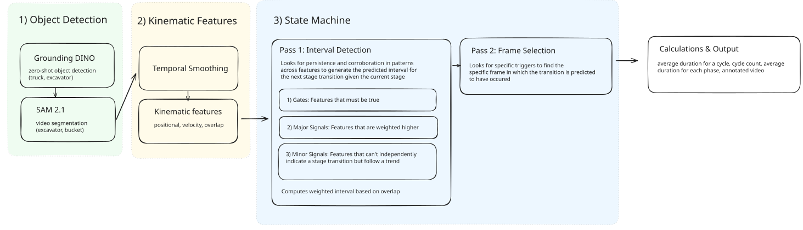

# Excavator Cycle Detection Computer Vision Pipeline

This computer-vision pipeline uses rule-based state detection to find every phase of an excavator work cycle and reports the average duration of each phase and of a complete cycle.

## Design



*Figure 1: Computer vision pipeline architecture*

### 1) Object detection:

The pipeline uses zero-shot object detection (Grounding DINO) and video segmentation (SAM 2.1) to find bounding boxes and masks for the dump truck, excavator, and bucket. To prevent SAM from merging the excavator mask with the truck during overlapping passes, negative spatial prompts are applied using the stationary truck's bounding box. Because standard object detectors struggle to reliably isolate the bucket, points on the bucket are located geometrically at the far end of the excavator arm (geodesic distance). These serve as prompts for SAM 2.1, yielding robustly tracking even when the bucket is temporarily buried or obscured.

### 2) Feature generation:

From the bucket’s box, a rolling window average is applied across raw coordinates to reduce frame-to-frame tracking jitter. The pipeline then derives interpretable kinematic features:

- Position
- Velocity (Savitzky-Golay to account for noise)
- 2-D speed
- Position along the line from the pile to the truck
- Bounding box aspect ratio
- Overlap percentage with the truck

### 3) State detection:

The pipeline implements a two-phase, physics-grounded state detection system. A rule-based approach was selected due to limited available data and practical constraints with labeling each phase.

**3.a) Pass 1 (Interval Detection):** Identifies the general temporal window where a phase transition occurs by evaluating corroborating patterns across multiple features:

- **Gates:** Physical prerequisites that must hold before any evidence counts (e.g., "bucket is over the truck" prior to a dump)
- **Required cues:** Mandatory kinematic markers within the interval (e.g., bucket rising to signal hauling)
- **Supporting cues:** Other correlating physical evidence weighted based on reliability.

The interval is where cues holding more than half the total weight overlap.

**3.b) Pass 2 (Frame Refinement):** These intervals are refined by looking at local kinematic cues to narrow down a specific frame where the transition occurred.

### 4) Output:

The pipeline writes:

- answer.json, with the cycle count, the average duration of each phase, and average cycle duration
- an annotated video showing the bounding boxes, phase information, and kinematic features

## Assumptions and Limitations

As a rule-based detection engine, the pipeline is best suited to videos framed like the provided one.

- **Static camera:** Assumes zero camera movement as movement breaks the velocity and positional cues
- **Visibility:** Works best when the excavator's full motion is visible as the segmentation model can better track the components
- **One excavator loading one dump truck**: Configured specifically for one excavator loading one dump truck (dumping onto a ground pile is not evaluated)
- **Lower Digging height:** Relies on low-bucket height cues during digging
- **Strict phase order:** Assumes a standard cycle sequence. Repeated or skipped phases are attributed to adjacent phases or force a skip to the next complete cycle
- **Short video length:** Performs optimally on shorter videos. The segmentation models may drift and errors in detection may propagate during longer stretches.

These assumptions reduce generalizability, but yield consistent kinematic cues that identification rests on.

## Execution

**Labeling:** To establish the heuristics driving the state engine, phases were manually labeled for the reference dataset. Feature graphs were analyzed for distinct kinematic signatures, keeping only patterns backed by the underlying physics of excavator operation (e.g., a loaded bucket must gain elevation to clear the material while hauling).

**Computation:** Detection and segmentation was run on a GPU (NCSA Jupyter cluster). Everything after that runs on the CPU.

**Testing:** Pipeline predictions were benchmarked against human-annotated timestamps. Additional open-source footage of similar excavator cycles was used for evaluation.

## Set up

Requires [uv](https://docs.astral.sh/uv/getting-started/installation/).

```bash
uv sync
```

This installs Python 3.12 and the pinned dependencies (`uv.lock`). An NVIDIA GPU is recommended as detection and segmentation during development was run on an NCSA Jupyter cluster. For reference, the pipeline took around 3 minutes to process a 30 second video and performs slower on CPU. 

Two models download automatically from Hugging Face on the first run (about 1.1 GB in total, cached in `~/.cache/huggingface`):

- [`IDEA-Research/grounding-dino-base`](https://huggingface.co/IDEA-Research/grounding-dino-base): Dino zero-shot detection of the excavator and the truck
- [`facebook/sam2.1-hiera-small`](https://huggingface.co/facebook/sam2.1-hiera-small): SAM 2.1 segmentation and tracking

## Running it

```bash
uv run run.py run path/to/video.mp4 --out results
```

The results folder (default `outputs/<video name>`) holds:

- `answer.json`: the cycle count and the average duration of each phase and of a complete cycle, in seconds
- `annotated.mp4`: the video with the boxes, current phase and its timer, the complete-cycle count, and the feature graphs with each detected phase start
- `phases.json` and `features.png`: every phase start with its search interval, and every feature plotted against time
- the cache (`masks.npz`, `features.npz`, ...) and `run.json`, a record of the run

---

Author: Aanya Shah (aanya3@illinois.edu)
