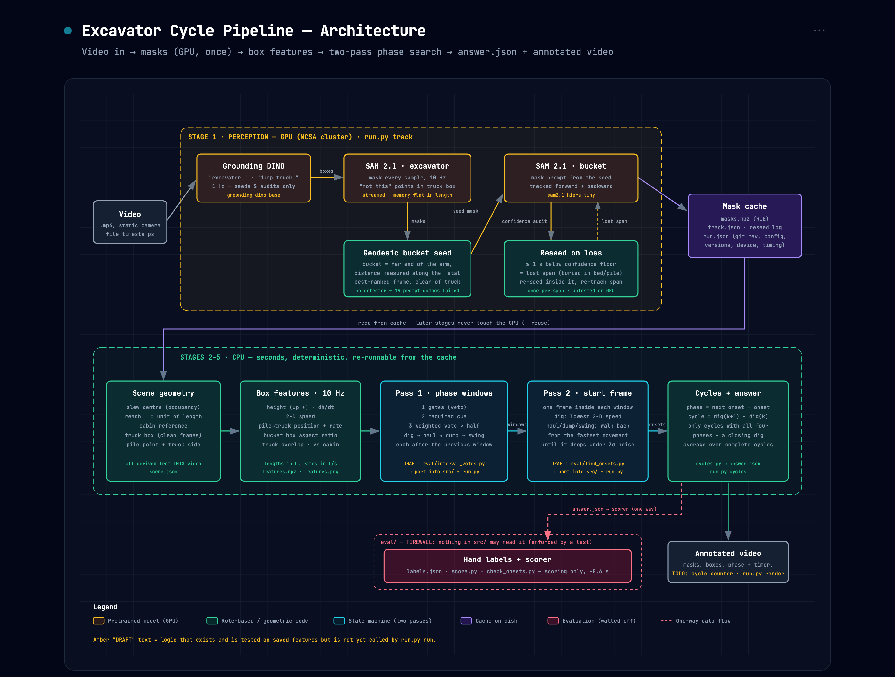
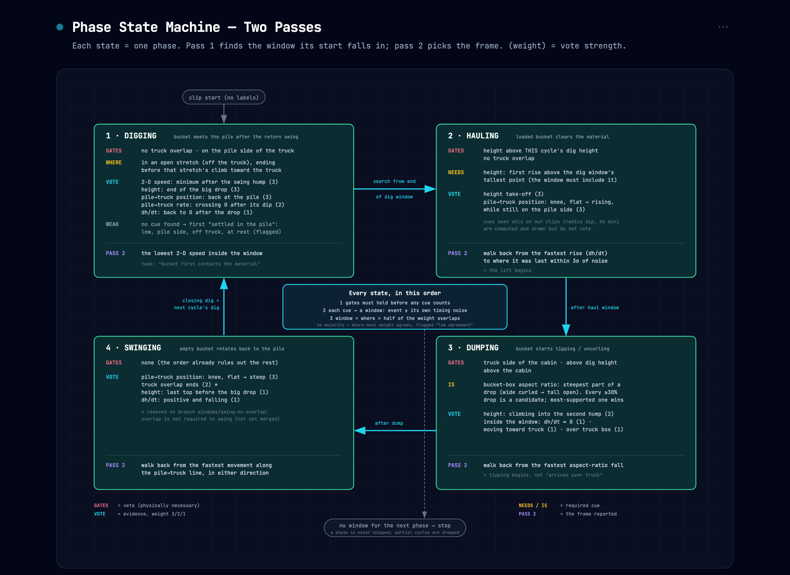

# Starter Task: Excavator Cycle Duration: Report

**Aanya Shah** · draft of 2026-09-28 · repository state: `main` @ `e7a8cfa`

> [!WARNING]
> **Draft.** This report describes the *phase-window* method as the pipeline. That
> method is implemented and tested on saved features (`eval/interval_votes.py`,
> `eval/find_onsets.py`), but `run.py run` does not call it yet. It still runs the
> previous state machine, `src/excavator_cycles/fsm.py`. Section 10 lists what must
> happen before submission. Every result here says which method and which code produced it.

---

## 1 · The task, and what "correct" means

An excavator work cycle has four phases that tile time with no gaps: **digging →
hauling → dumping → swinging**. Each phase ends the instant the next one begins. The
pipeline must find every *complete* cycle in a video and report the average duration
of each phase and of the cycle. It is graded on the given video plus two hidden ones,
with **±0.6 s (~18 frames) tolerance per field**.

Two consequences of that grading shaped the design:

- **A duration is the difference of two onsets**, so its error is the difference of
  two onset errors. If both onsets are 0.4 s late, the duration is exact. If one is
  0.4 s early and the next 0.4 s late, the duration is off by 0.8 s and fails. Onset
  accuracy is necessary, but the grade is decided by pairs of onsets.
- **The hidden videos are the real test.** Any number tuned to look right on the given
  video is a liability. This rules out hardcoding, and it also rules out *soft*
  overfitting: thresholds, weights and cue choices picked because they happened to work
  on the clips I looked at.

Phase definitions used (from the task, with one clarification of mine):

| Phase | Begins when… | Read from |
|---|---|---|
| Digging | the bucket first contacts the material | the bucket comes to rest at the pile after the return swing |
| Hauling | the loaded bucket clears the material surface | the bucket's height starts to rise above this cycle's dig level |
| Dumping | the bucket starts **tipping or uncurling** | the bucket box's aspect ratio starts to fall (wide curled → tall open) |
| Swinging | the excavator starts rotating back | the bucket starts moving along the pile↔truck line |

**Clarification: dumping starts at tipping, not arrival.** On the dev clip the hand
label put the dump at 18.65 s, when the bucket *arrives* over the truck. The frames show
it still curled there. It opens at ~21.0 s and is fully open by 21.7 s. The task's
wording ("starts tipping or uncurling") points to the later moment, so the pipeline
follows the aspect ratio, and that label is treated as wrong until it is revised.

---

## 2 · Pipeline overview

The pipeline has two halves with very different costs:

1. **Perception (GPU, once per video).** Pretrained models turn pixels into masks of
   the excavator and the bucket. They are cached to disk with full provenance (git
   revision, config, library versions, device, timing).
2. **Everything else (CPU, seconds).** Geometry, features, the state machine, cycle
   assembly and rendering all read the cache. They never load a model, so the rules can
   be iterated on a laptop and re-run on the cluster's output in under a second.

The guiding principle: **detect as little as possible, derive as much as possible.**
Detectors are reliable on whole machines and unreliable on *parts* (a bucket) and on
*amorphous stuff* (a dirt pile). So only the excavator and the truck are detected.
Everything else (the bucket, the slew centre, the arm's reach, the cabin, the pile) is
computed from how the excavator's own mask behaves over time.

---

## 3 · Stage 1: Perception

### 3.1 Detection: Grounding DINO

`IDEA-Research/grounding-dino-base`, text prompts `"excavator."` and
`"dump truck."`/`"truck."`, run at **1 Hz**.

- **Why a zero-shot, text-prompted detector:** there is no labelled training data for
  this site, and the task allows text-conditioned detection that returns boxes. On the
  dev clip the excavator was found in 100% of sampled frames (median score 0.73).
- **Why only 1 Hz:** on this footage the detector *merges* the excavator and the truck
  into one box in about half the frames. It is less reliable than the tracker, so it
  seeds and audits the tracker and does not drive it.
- Prompt choice was measured, not guessed: `"digger."` also finds the excavator but
  fires on trucks too (`docs/stages/01-perception-findings.md`).

### 3.2 Segmentation and tracking: SAM 2.1

`facebook/sam2.1-hiera-tiny`, at 10 Hz, one object per session, tracked forward and
backward from the best seed frame.

- **Negative points in the truck box.** Placing "not this" points inside the truck's
  box makes a merged detection harmless: mask area dropped from 13.8% of the frame (both
  machines) to ~7% (the excavator alone). The dev clip got 296/296 masks, with a median
  IoU of 0.91 against independent detections.
- **Streaming.** SAM 2 originally prepared every frame on the GPU up front. On an 83 s
  clip that was a single 9.75 GiB allocation, which failed on a shared H200. Frames are
  now streamed one at a time and dropped once they leave the model's memory window, so
  memory stays flat however long the video is. A crash on a long hidden video would
  have meant no answer at all.

### 3.3 Finding the bucket by geometry

Three of the four onsets depend on the **bucket**, and no detector could box it:
nineteen prompt × model combinations across Grounding DINO and OWLv2 were tried. The
best one (`"excavator bucket."`) boxed the *whole machine*, because it matched the word
"excavator".

The bucket is instead found from what a bucket *is*: **the far end of the arm.**

- Distance is measured **geodesically, along the machine's mask**, rather than in a
  straight line. With a straight line, a raised boom's apex outranks the bucket, which
  put the seed ~70 px off target during dumps.
- This is done **once**, on a frame the pipeline chooses (ranked by reach, compactness,
  and clearance from the truck), and SAM 2 then tracks that region. Repeating the
  farthest-point calculation on every frame was one of the failed arm-pose attempts
  (§8).
- The seed is passed to SAM 2 as a **mask**, not points or a box. SAM 2's own ablation
  scores prompt types at 77.6 (mask), 75.4 (5 clicks) and 72.9 (box) J&F.

### 3.4 Reseeding when the bucket is lost

The bucket routinely disappears: it is buried in the pile while digging and in the
truck bed while dumping. SAM 2 recognises an object by comparing each frame with a
memory of recent frames. After about a second of seeing nothing, that memory is mostly
"nothing". On one unseen clip the bucket was lost at 34.7 s and never reclaimed, while
it was plainly visible for the remaining 10.6 s.

Now, after the bucket pass, any run of samples below the features stage's own confidence
floor lasting ≥ 1 s counts as a **lost span**. The pipeline picks a reseed frame *inside*
that span (with no bucket pixel inside the truck box) and re-tracks only that span. Each
span is tried once. Checked without a GPU on every saved run: no reseed on the clips
that kept the bucket, and the right frame chosen on the one that lost it. **The re-track
itself has not yet been run on the cluster.**

**Rejected: flagging a partly hidden bucket by its shrinking area.** On correctly
tracked cycles, the area drops below half its median for up to 1.6 s. That happens
because the bucket *tips*, and tipping is exactly the dump signal.

---

## 4 · Stage 2: Scene geometry and features

### 4.1 The scene, derived from this video

| Quantity | How it is derived |
|---|---|
| Slew centre | the pixels that are excavator in ~90% of frames (the machine's persistent core) |
| **L**, the unit of length | the arm's 95th-percentile reach from the slew centre, in this video's pixels |
| Cabin reference | per frame: that frame's mask restricted to the persistent core |
| Truck box | from frames where excavator and truck are cleanly separated (a parked truck does not move) |
| Pile | the bucket's median position over its lowest tenth of heights, off the truck |
| Truck side | which way the truck lies from the machine, measured, never assumed |

### 4.2 Features, at 10 Hz, from the bucket's box

| Feature | Physical meaning | Used by |
|---|---|---|
| height (up = +) and dh/dt | lift and lowering | dig, haul, dump, swing |
| 2-D speed | at rest vs moving | dig |
| position along the pile→truck line, and its rate | where the bucket is between pile (−1) and truck (0) | dig, haul, swing, side gates |
| bucket-box aspect ratio | curled (wide) vs open (tall), i.e. tipping | dump |
| truck overlap | bucket over the truck box | gates, dump check, swing |
| bucket vs cabin (x, y) | which side of the machine, above or below the cabin | dump gates |

**Units:** lengths in L and rates in L/s, so a feature means the same thing on a
480-pixel video and a 4K one, near or far. **Times** come from the file's own
timestamps, never `frame_index / fps`. The dev clip's container claims 1102 frames when
886 decode, and variable-rate screen recordings drifted up to 3.4 s under the fps
assumption.

**The pile→truck line** replaced raw image *x*. Image x assumes a side-on camera. The
line runs from the video's own pile to its own truck, so it points in whatever direction
the camera sees it. Horizontal cues are signed toward the truck, so mirrored footage
should read the same. This is tested for the fsm shape cues (`test_mirrored_footage_reads_the_same`)
but not yet for the window method.

### 4.3 Why bounding boxes, and not arm pose or optical flow

Two richer measurements were built first, and both failed for the same reason: they
tried to read a 3-D articulated motion from a 2-D projection.

| Attempt | What failed | Evidence |
|---|---|---|
| Fitted 3-link arm chain (boom/stick/bucket angles) | "rigid" links varied 5.2–8.2× in length, and joints jumped 0.466 L in 0.1 s | `docs/stages/05-kinematic-spec.md` |
| Dense optical flow for house rotation | the machine slews about a **vertical** axis, so in the image it *translates* sideways rather than rotating. The flow "rotation" correlated with the real slew at **r = 0.025** (chance) | `docs/stages/04-motion-field-probe.md` |

A bounding box is a weaker measurement, but one that holds up.

### 4.4 Smoothing

- Box coordinates: trailing 0.5 s smoothing (0.3 s and 0.5 s gave the same results;
  0.9 s blurred onsets away).
- Derivatives: a Savitzky–Golay filter over 0.9 s, polynomial order 2. It is symmetric,
  so it smooths without moving peaks and troughs in time. It also sets a floor: a rate
  event cannot be placed more precisely than about ±0.45 s.
- Confidence: a sample below 0.35 SAM 2 confidence is **missing**, not zero.

---

## 5 · Stages 3–4: The state machine

### 5.1 How it got here

| Generation | Onset cue | Result on the 83 s clip (13 labelled onsets) |
|---|---|---|
| Level cues | "bucket is down and still" etc. | **0 / 13** within ±0.6 s. A level is true for a whole phase, so it cannot say when the phase *starts* |
| Shape cues (`fsm.py`, what `run.py` runs today) | the trend change around a sample: fit a line 2 s either side and name the pair (e.g. "falling → flat") | 10 / 13 |
| **Phase windows + start frame** (this report) | several cues vote on a window, then one rule picks the frame | windows **13 / 13**; frames 10 / 13 |

The shape cues had the right idea (a phase starts at a *change*), but each phase hung on
**one** cue, so one bad cue lost the phase and cascaded into the next. The window method
asks several independent pieces of evidence to agree.

### 5.2 Two passes

- **Pass 1: "roughly when?"** Output: a window of about 1–2 s that should contain the
  phase's start. It is built to be *reliable*: several cues must agree.
- **Pass 2: "which frame?"** One physical rule picks a frame inside that window. It is
  built to be *precise*, and it may only answer inside the window.

The asymmetry is deliberate. A bad frame inside a good window costs a fraction of a
second. A bad window can lose a whole cycle.

### 5.3 Pass 1, in three steps per phase

Phases are searched **strictly in order**: dig → haul → dump → swing → dig. Each search
begins where the previous phase's window ends, and starts at the clip's first frame. **No
labels are read**; they are used only for scoring afterwards.

1. **Gates (veto).** These are physically necessary conditions. No cue counts until
   every gate holds. A gate cannot find the moment; it removes moments where the phase
   *cannot* be starting. To be used as a gate, a rule had to be physically necessary, true
   at the instant of every labelled onset, **relative** (e.g. "above *this cycle's* dig
   height", never "height > 0.3"), and orientation-free.

   | Phase | Gates |
   |---|---|
   | Dig | no overlap with the truck box · on the pile side of the truck |
   | Haul | above this cycle's dig height · no truck overlap |
   | Dump | truck side of the cabin · above this cycle's dig height · above the cabin |
   | Swing | none: the ordering already excludes everything else |

2. **Required cue.** Haul *needs* the height take-off: the first rise above the dig
   window's tallest point. Dump *is* the steepest aspect-ratio drop. Every drop of ≥ 30% is
   a candidate, and the one with the most supporting weight wins.

3. **Weighted vote.** Each supporting cue proposes its own window: the event's centre
   plus or minus its **timing uncertainty** (the signal's noise divided by how sharply
   its slope changes there), clamped to ±0.75–1.2 s. The phase window is where
   supporting cues holding **more than half the total weight** overlap. Weights: strong
   = 3, medium = 2, weak = 1.

   | Phase | Supporting cues (weight) |
   |---|---|
   | Dig | 2-D speed minimum after the swing hump (3) · end of the big height drop (3) · back at the pile (3) · pile→truck rate crossing 0 (2) · dh/dt back to 0 (1) |
   | Haul | height take-off (3) · pile→truck knee, flat → rising (3) |
   | Dump | climb into the second height hump (2) · inside the window: dh/dt ≈ 0 (1), moving toward the truck (1), over the truck box (1) |
   | Swing | pile→truck knee, flat → steep (3) · truck overlap ends (2) · last height top before the big drop (1) · dh/dt positive and falling (1) |

**Details that matter:**

- **Digs are searched inside "open stretches"**, the time between dump stretches, and
  must end before that stretch's climb toward the truck. This stops a dig window from
  reaching into the haul. If no dig cue fires, a weak fallback takes the first moment the
  bucket is low, on the pile side, off the truck and at rest. It is flagged as weak. This
  is how a clip that opens mid-dig keeps its first cycle.
- **No majority → still a window, flagged.** Every cycle has every transition, so when
  no location wins more than half the weight, the window goes where the most weight
  agrees, marked "low agreement".
- **Cues seen only on our clips do not vote.** Several patterns (radius dips and bumps,
  a dx minimum, cabin-x rising) appeared on the development graphs with no physical
  reason to expect them elsewhere. They are still computed and drawn, so a new clip can
  confirm one, but they carry no vote.
- **A phase is never skipped.** If the next phase gets no window, the search stops and
  reports where.

### 5.4 Pass 2: the frame

| Phase | Rule | Physical meaning |
|---|---|---|
| Dig | lowest 2-D speed inside the window | the bucket has stopped against the pile |
| Haul | walk back from the fastest rise in dh/dt until the rate is within 3× its own noise | the lift begins |
| Dump | same walk-back on the aspect ratio's fall | tipping begins |
| Swing | same walk-back on movement along the pile↔truck line, either direction | the swing begins |

"Walk back to rest" was tried first and failed. The bucket is still moving when the tip
begins, so waiting for stillness slid 4–10 s back into the haul on two of three dumps.
If nothing inside the window moves faster than its noise, the window's centre is
reported and flagged.

### 5.5 Cycles and the answer

For onsets *d₁ < h₁ < p₁ < s₁ < d₂ < …* (dig, haul, dump, swing):

- digging_k = h_k − d_k   hauling_k = p_k − h_k   dumping_k = s_k − p_k   swinging_k = d_{k+1} − s_k
- cycle_k = d_{k+1} − d_k  (equal to the sum of the four by construction)
- A cycle counts only if all four onsets **and the closing dig** d_{k+1} were found.
  Partial cycles at either end are dropped.
- Each reported average is the mean over the N complete cycles:
  `average_phase = (1/N) Σ phase_k`, `average_cycle = (1/N) Σ cycle_k`, and `cycle_count = N`.

---

## 6 · Results

### 6.1 Labelled clips: the window method, label-free

Both clips were used while designing the cues, so these numbers are **optimistic**.
Onset errors are signed (+ = the pipeline is late).

**83 s clip, 3 cycles: 13/13 windows contain the labelled onset; 10/13 frames within
±0.6 s.**

| | Cycle 1 | Cycle 2 | Cycle 3 | Closing dig |
|---|---|---|---|---|
| Dig | +0.47 | +0.34 | −0.02 | +0.56 |
| Haul | +0.34 | −0.46 | **−0.75** | |
| Dump | **+0.61** † | +0.35 | −0.14 | |
| Swing | **−0.79** | −0.02 | +0.13 | |

Mean |error| per phase: dig 0.35 s · haul 0.51 s · dump 0.37 s · swing 0.31 s.
† No movement above noise inside this window, so the window's centre was reported.

**29.6 s dev clip, 1 cycle: 4/5 windows; frames: dig +0.63, haul −0.23, dump +1.97\*,
swing −0.23, closing dig +0.17.**

\* This is measured against the "arrival" label discussed in §1. The pipeline's dump
(20.62 s) falls where the frames show the bucket starting to open (~21.0 s). A revised
label is needed before this can be called right or wrong.

### 6.2 Unseen clips: rules frozen at tag `windows-v1`, no labels

To test generalisation, the window rules were frozen *before* running them on new
clips. Any fix made after seeing those results is a new version and needs yet another
unseen clip.

| Clip | Camera | Phases found, in order | Stopped | Likely cause |
|---|---|---|---|---|
| `random` | static | dig (weak) · haul · dump · swing · **dig** · haul | looking for dump at 33.9 s | bucket lost at 34.7 s (before reseeding existed) |
| `vid2` | static | dig · haul · dump · swing | looking for the closing dig at 13.8 s | clip ends / dig cues missing |
| `vid1` | static | dig (1.2 s) · haul (28.2 s) | looking for dump | 25 s between dig and haul, so lifts were probably missed in between |
| `15107636` | **moving** | dig | looking for haul | bucket lost for 17 s |
| `16499298` | **moving** | dig | looking for haul | bucket seeded on the *tracks* |

**One complete cycle from five clips.** This is the most important result in the
report. On the development clips the rules look nearly solved. On unseen clips they
mostly stall early. Most stalls trace back to perception (a lost or mis-seeded bucket)
or to the strict ordering, where one missed phase ends the search.

An unmerged experiment (`experiment/no-cabin-gate`) replaces the 2-D "overlaps the truck
box" test with "over the truck bed" (inside the truck's horizontal span *and* above its
middle). It also lets a strong dig abandon a cycle whose next phase is missing. On six
unseen clips it raised the cycles found from **7 to 13 of ~23 lifts**, with the two
labelled clips unchanged.

### 6.3 What `run.py run` produces today (fsm.py shape cues)

On the dev clip `answer.json` passes **4 of 6** fields: `cycle_count`, the cycle average,
digging and swinging. Hauling and dumping each miss by ~1.5 s, both caused by the same
1.8 s-late dump.

### 6.4 Tests

`uv run pytest`: **496 passed, 1 xfailed** (2026-09-28). The tests use synthetic video
and need no weights or GPU. They include:

- a firewall test that fails if anything in `src/` references `eval/` or the labels;
- a dead-code gate;
- ratchets that fail if any labelled onset error gets worse;
- a strict `xfail` that turns green when the dev clip's dump lands in its window.

---

## 7 · Failure modes and limitations

1. **Everything depends on the bucket mask.** A lost bucket stops the features; a
   mis-seeded one (the tracks, on a moving-camera clip) produces confident nonsense
   that no current check catches. An "is the bucket at the far end of the arm?" audit
   would catch it and is designed but not built.
2. **Strict ordering.** The state machine assumes dig → haul → dump → swing, every
   time. If the operator digs twice, or dumps on the pile and digs again, that time is
   misattributed to the current phase. If a phase is missed, the search stops. The
   no-cabin-gate experiment's recovery rule is a first step.
3. **Static camera (stated assumption).** The slew centre, the truck box and the pile
   are measured once per clip. On the moving-camera clips the masks were fine (IoU
   0.89–0.99) but the "persistent core" became a smear.
4. **The dump target must be a truck.** A dump onto a spoil pile or into a hopper breaks
   the dump gates.
5. **Remaining fixed numbers.** The vote weights (3/2/1), the window half-widths
   (±0.75–1.2 s) and the 30% aspect-drop threshold are judgment calls, not derived from
   the video. An attempt at equal votes with durations relative to the measured cycle
   period is on `windows/relative-rules` and is not merged.
6. **Two labelled clips, four labelled cycles in total.** The labels have known flaws:
   the dump-arrival issue (§1), and an asymmetric dig offset (+9 vs +22 frames) on the
   dev clip that adds ~0.43 s to its swing and cycle labels.
7. **Shallow crossings.** Where the bucket leaves the material slowly, measurement
   noise alone costs a large part of the ±0.6 s budget. This is where the haul onset
   will fail first.

---

## 8 · Alternatives considered

| Alternative | Verdict | Why |
|---|---|---|
| Train an action/phase classifier | not pursued | one ~1-minute labelled video (plus one more of mine) is far too little data. A rule-based method needs no labels to *run*, and it can be inspected |
| Vision-language model | **not allowed** by the task | — |
| YOLO / YOLO-World detection | dropped | Grounding DINO was more reliable on the excavator; YOLO-World code is archived (`deprecated/optical-flow`) |
| Detect the bucket directly | failed | 19 prompt × model combos; the best boxed the whole machine |
| Arm pose from a fitted chain | failed | link lengths varied 5.2–8.2× (§4.3) |
| Optical-flow rotation | failed | r = 0.025 with the true slew (§4.3) |
| Level cues ("down and still") | failed | 0/13 onsets: a level says *whether*, not *when* |
| Single shape cue per phase | superseded | 10/13, but one bad cue cascades |
| HMM / Viterbi smoothing | considered, not built | it would handle skipped or repeated phases more gracefully, but needs transition and emission probabilities we don't have the data to estimate honestly |
| Min/max time-in-phase checks | not used | the only way to set the bounds is from the clips, which is the overfitting the task bans |

---

## 9 · Decision log

| Date | Decision | Why |
|---|---|---|
| 09-21 | Detect only the excavator and the truck; detector at 1 Hz, tracker at 10 Hz | the detector merges the two machines in ~half the frames |
| 09-21 | Negative points in the truck box | mask area 13.8% → 7% |
| 09-22 | Abandon the arm chain and optical flow | 3-D motion can't be read from 2-D projection (§4.3) |
| 09-25 | Rebuild on bounding boxes; move old work to `deprecated/…` branches | the only measurement that worked, and it was uncommitted |
| 09-25 | Find the bucket geometrically (geodesic), prompt SAM 2 with a mask | no detector could box it |
| 09-26 | Stream frames to SAM 2 | 9.75 GiB allocation crashed a long clip |
| 09-26 | Onset cues from *shapes*, not levels | 0/13 → 10/13 |
| 09-27 | Hard gates vs soft evidence (`docs/stages/09-rules-draft.md`) | gates stop cascades; they barely sharpen timing |
| 09-27 | **Dump starts at tipping** (aspect-ratio drop), not arrival | the task's own definition |
| 09-27 | Phase windows by weighted vote, then one frame per window | one cue per phase was too brittle |
| 09-27 | **Everything runs label-free**; labels only score | the pipeline must run on hidden videos with no input |
| 09-27 | Freeze rules at `windows-v1` before unseen clips | an unseen clip is only unseen once |
| 09-27 | **Static camera is in scope; moving camera is not** (stated assumption) | the fixed-camera geometry breaks under camera motion |
| 09-27 | Reseed the bucket per lost span | the bucket is buried every dig and every dump |
| 09-28 | Read every frame's time from the file *(branch `fix/real-timestamps`, unmerged)* | fps-derived time drifted up to 3.4 s on variable-rate video |
| 09-28 | Truck overlap is not a swing requirement *(branch `windows/swing-no-overlap`, unmerged)* | the bucket can start back while still over the truck |

---

## 10 · Before submission: ordered checklist

- [ ] **Port the window method into `src/`** (`interval_votes` → pass 1, `find_onsets` →
      pass 2, plus `pile_truck_axis` from `eval/check_cues.py`) and wire it into
      `run.py run`. The existing firewall test then guards it.
- [ ] Feed its onsets into `cycles.py` so `answer.json` comes from the window method.
- [ ] Add a **cycle counter** and cycle timer to the annotated video (it shows the phase
      and its timer today).
- [ ] Merge `fix/real-timestamps` (fixes the render crash on large videos too) and
      decide on `windows/swing-no-overlap` and `experiment/no-cabin-gate`. Each changes
      the rules after the freeze, so each needs a fresh unseen clip.
- [ ] Run the bucket reseed on the cluster and confirm `random` recovers after 36 s.
- [ ] Revise the dev clip's dump label to the tipping definition, then re-score.
- [ ] Run the final pipeline on the task video on the cluster, then commit `answer.json`
      and the annotated video.
- [ ] Remove the DRAFT banners; exclude `yolov8x-worldv2.pt`, `recovered-scratchpad/`
      and `outputs/` from the zip.

---

## References

1. Cheng, Cao & Nuralim. "Computer vision-based deep learning for supervising excavator
   operations and measuring real-time earthwork productivity." *J. Supercomputing* 79.4
   (2023): 4468–4492.
2. Molaei et al. "Automatic estimation of excavator actual and relative cycle times in
   loading operations." *Automation in Construction* 156 (2023): 105080.
3. Kim, Chi & Seo. "Interaction analysis for vision-based activity identification of
   earthmoving excavators and dump trucks." *Automation in Construction* 87 (2018): 297–308.
4. Liu et al. "Grounding DINO: Marrying DINO with Grounded Pre-Training for Open-Set
   Object Detection." ECCV 2024.
5. Ravi et al. "SAM 2: Segment Anything in Images and Videos." 2024.

Per-stage findings, including negative results, are in `docs/stages/01…10`.

*I used Claude Code to write much of the code. The design decisions, the phase
definitions and the rules are mine, and are recorded with their reasoning in
`docs/stages/`. In a lab I would follow its AI-use policy and best practices for code.*
